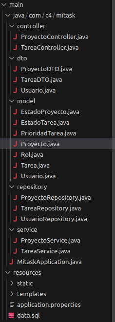
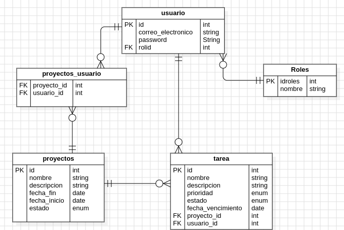

# MiTask
# Backend - MiTask

Este es el backend del sistema para la gestionar los proyectos  desarrollado con **Spring Boot**. Gestionando tareas y proyectos de un equipo de trabajo.

## 🧾 Descripción General

El sistema busca centralizar y organizar la información de cada uno de los proyectos:
- Crear, editar, consultar y eliminar proyectos.
- Crear, editar, consultar y eliminar tareas relacionadas a proyectos específicos.
- Gestión de usuarios y roles (Administrador, colaborador).

---

## 📁 Estructura del Proyecto

## 🔐 Seguridad

- Implementada con **Spring Security** y **JWT**.
- Filtro personalizado `JwtAuthenticationFilter` para validar cada solicitud.
- Configuración de CORS incluida en `SecurityConfig.java`:

## 🚀 Endpoints

Todos los endpoints están documentados con **Swagger**.

Accede a la documentación interactiva en: `http://localhost:8081/swagger-ui.html`.

## 📦 Tecnologías

- **Java 17+**
- **Spring Boot**
- **Spring Security + JWT**
- **JPA / Hibernate**
- **MySQL**
- **Swagger**
- **Visual Studio code**
- **dbeaver**
---

## Pasos para ejecutar el proyecto

- Clonar el repositorio
- Ingresar a dbeaver y crear la base de datos llamada **mitask**
- **Tener en cuenta que el usuario y contraseña es = campus2023**
- Utilizar las extensiones Spring Boot tools, 
- Ejecutar desde el visual studio code

## Diagrama Relacional

## Datos de prueba
  

## 👥 Autores

- Eimer Santiago
- Iván Villamizar
- Anderson Galvis

---
